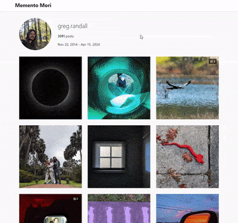

# Memento Mori - Instagram Archive Viewer

## Overview

**Memento Mori** is a tool that converts your Instagram data export into a beautiful, standalone viewer that resembles the Instagram interface. The name "Memento Mori" (Latin for "remember that you will die") reflects the ephemeral nature of our digital content. You can see an example at [gregr.org/instagram](https://gregr.org/instagram/).

## Quick Start
Get your Instagram data export zip, throw it in with this code, and run this command:
```bash
docker compose run --rm memento-mori
```
Then open output/index.html in your browser


## ⚠️ IMPORTANT SECURITY WARNING ⚠️

**DO NOT** share your raw Instagram export online! It contains sensitive data you probably don't want to share:

- Phone numbers
- Precise location data
- Personal messages
- Email addresses
- Other private information

Only share the generated output folder after processing with this tool.

## How It Works
Memento Mori processes your Instagram data export and generates a static site with your posts, copying all your media files into an organized structure that can be viewed offline or hosted on your own website.

## Key Features
- **Familiar Interface**: Grid layout with post details and carousel for multiple images
- **Media Optimization**: Converts images to WebP, generates thumbnails, and supports video playback
- **Organization**: Sorts posts by various criteria with shareable links to specific content
- **Technical Improvements**:
  - Fixes encoding issues and mislabeled file formats
  - Shortens filenames for smaller HTML size
  - Processes files in parallel with a responsive design that works on all devices

## How to Use Memento Mori

### 1. Get Your Instagram Data
1. Request and download your Instagram data archive
2. Place the zip within the folder of this repo

### 2. Preferred Method: Using Docker (Easiest)
Docker Compose is the easiest way to run Memento Mori without installing any dependencies:
```bash
# Build the Docker image
docker compose build

# Run with default settings
docker compose run --rm memento-mori

# Run with specific arguments
docker compose run --rm memento-mori --output /output/my-site --quality 90
```

By default, Docker will:
- Search for exports in the project directory
- Output the generated site to the './output' directory

### 3. Alternative Method: Direct Python Installation
If you prefer running the tool directly without Docker:
```bash
# Install package and dependencies
pip install -e .

# Or install dependencies manually
pip install ftfy==6.3.1 Jinja2==3.0.3 MarkupSafe==2.1.5 opencv_python==4.10.0.84 Pillow==11.1.0 tqdm==4.67.1 python_magic==0.4.27

# Run the CLI
python -m memento_mori.cli
```

### CLI Arguments
The CLI supports the following arguments:
```
Options:
--input PATH Path to data (ZIP or folder). If not specified, auto-detection will be used.
--output PATH Output directory for generated website [default: ./output]
--threads INTEGER Number of parallel processing threads [default: core count - 1]
--search-dir PATH Directory to search for exports when auto-detecting [default: current directory]
--quality INTEGER WebP conversion quality (1-100) [default: 80]
--thumbnail-size WxH Size of thumbnails [default: 292x292]
--no-auto-detect Disable auto-detection (requires --input to be specified)
```

Note: Auto-detection is enabled by default and will look for exports in the current directory. Use `--no-auto-detect` if you want to disable this feature and specify an input path manually.

### Example Commands
```bash
# Auto-detect export in current directory
python -m memento_mori.cli

# Specify input file/folder and output directory
python -m memento_mori.cli --input path/to/export.zip --output my-site

# Use specific number of threads and image quality
python -m memento_mori.cli --threads 8 --quality 90

# Specify search directory for auto-detection
python -m memento_mori.cli --search-dir ~/Downloads

# Use custom thumbnail size
python -m memento_mori.cli --thumbnail-size 400x400

# Disable auto-detection (requires specifying input)
python -m memento_mori.cli --no-auto-detect --input path/to/export.zip

```

## Key Features
- **Auto-detection**: Memento Mori will automatically look for Instagram archive ZIP files or extracted folders in the specified directory. The ZIP file can be placed anywhere within the project folder and it will be discovered.
- **Multi-threading**: Process media files in parallel for faster conversion using multiple CPU cores.
- **WebP Conversion**: Convert images to WebP format when it results in smaller file sizes for better performance.
- **Thumbnail Generation**: Generate thumbnails for images and videos to improve loading performance.
- **Filename Shortening**: Shortens long filenames to reduce HTML file size.
- **Text Encoding Fixes**: Automatically fixes common text encoding issues in captions and descriptions.
- **Optimized JSON**: Uses shortened keys in JSON data to reduce HTML file size.

## Viewing Your Generated Site
After the tool finishes processing your Instagram data:
1. The website will be generated in the output directory (default: ./output)
2. Open the `index.html` file in this directory with your web browser to view your Instagram archive
3. You can also upload the entire output directory to a web hosting service to share it online

## PHP Version (Alternative)
For those who prefer the deprecated PHP implementation:
```bash
# Run from command line
php index.php
```

## Why This Exists
Instagram, like many social platforms, has undergone significant "enshittification" - a term coined to describe how platforms evolve:

1. First, they attract users with a quality experience
2. Then, they leverage their position to extract data and attention
3. Finally, they degrade the user experience to maximize profit

When requesting your data from Instagram, the export you receive contains your content but in a format that's intentionally difficult to navigate and enjoy. Memento Mori solves this problem by transforming your archive into an intuitive, familiar interface that brings your memories back to life.
